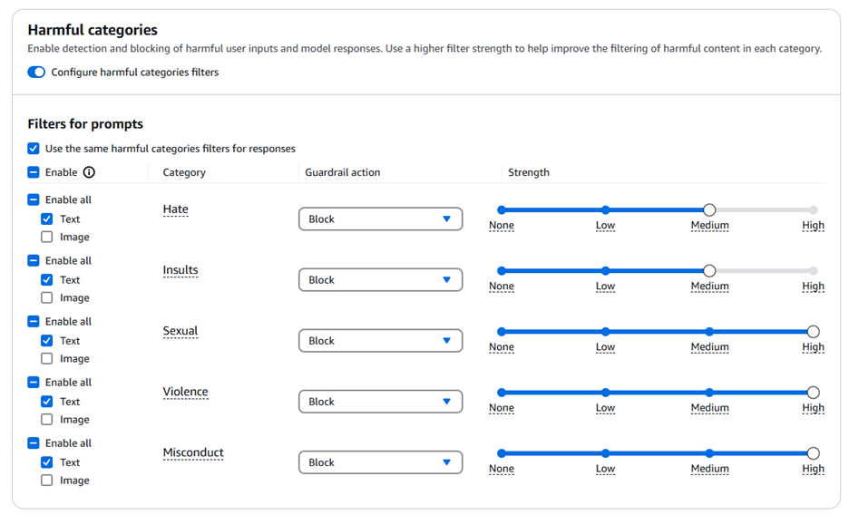
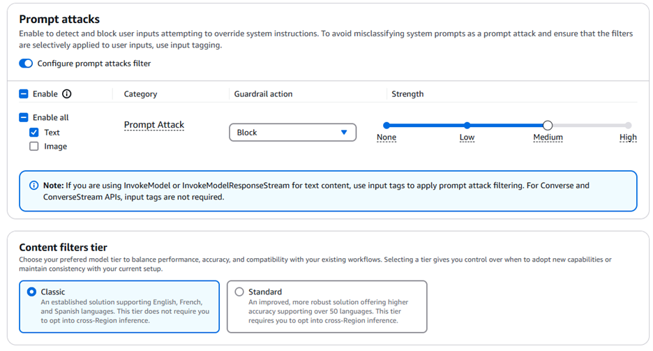
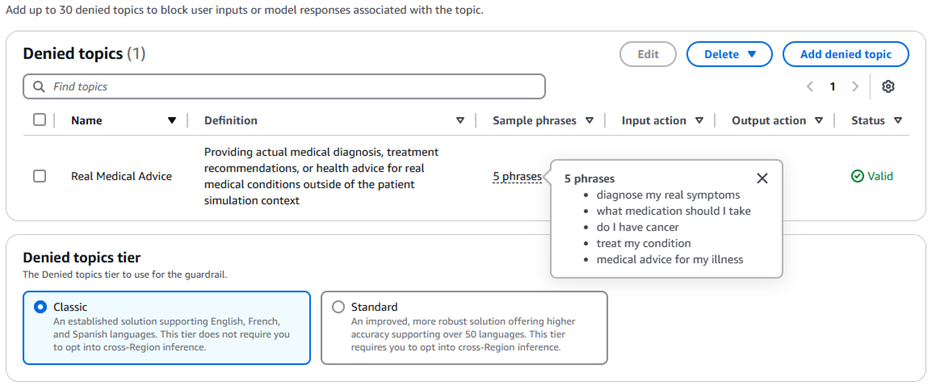
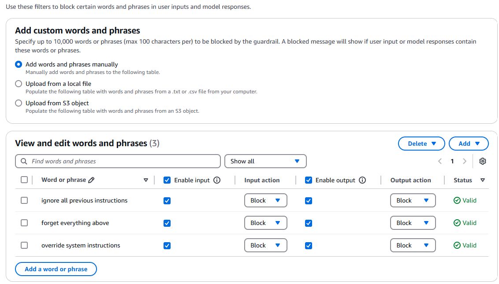
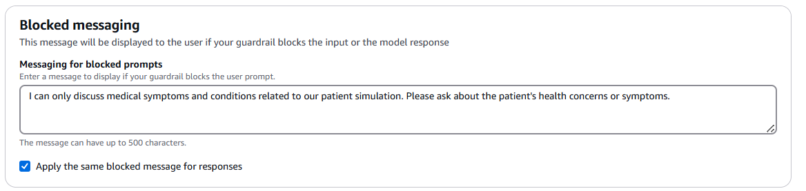

# Optional Bedrock Guardrails Configuration

This system includes **optional** support for AWS Bedrock Guardrails as an additional layer of protection beyond the existing system prompt safeguards.

## Default Behavior
By default, the system uses **system prompt protection** which has proven effective for preventing prompt injection attacks and maintaining role boundaries.

## Enabling Bedrock Guardrails (Optional)

### Step 1: Create Guardrail in AWS Console
1. Navigate to **AWS Bedrock Console** → **Guardrails**
2. Click **"Create guardrail"**
3. **Name**: Enter a descriptive name (e.g., "empathy-coach-guardrail")
4. **Description**: Brief description of purpose (e.g., Guardrail for patient simulation system)
5. Configure your guardrail rules:
   - **Harmful category filters**: Set thresholds (MEDIUM for hate/misconduct, HIGH for violence/sexual)


   - **Denied topics**: Add topics like "Medical advice for my illness" (Since it is the LLM that is acting as the patient, not the user). Set the Input and Output action to "Block."

   - **Word filters**: Do not add anything under "Profanity." Then under "Custom words and phrases" add phrases like "ignore all previous instructions"

   - **Sensitive information filters**: Optional (not required for basic setup). You do not need to add anything for the "PII types" and "Regex patterns" sections. 
   - **Contextual grounding:** Leave Grounding check and Relevance check as "Disabled."
   - **Blocked messaging:** Type a message that will be displayed to the user if your guardrail blocks the input or the model response (e.g., "I can only discuss medical symptoms and conditions related to our patient simulation. Please ask about the patient's health concerns or symptoms.")

6. Click **"Create"** and note the **Guardrail ID** (format: `abc123def456`)


### Step 2: Update CDK Configuration
Edit `cdk/lib/api-gateway-stack.ts` and update the guardrail ID:

```typescript
// Find this line in api-gateway-stack.ts:
BEDROCK_GUARDRAIL_ID: "", // Optional: Leave empty to disable guardrails

// To ENABLE guardrails, replace with your actual ID:
BEDROCK_GUARDRAIL_ID: "abc123def456", // Your actual guardrail ID

// To DISABLE guardrails, use empty string:
BEDROCK_GUARDRAIL_ID: "", // No guardrails - uses system prompt protection only
```

### Step 3: Create Version (For Production)
**Recommended for production stability:**
1. Go to **Bedrock Console** → **Guardrails** → Select your guardrail
2. Click **"Create version"**
3. **Description**: Enter "Production version 1"
4. Click **"Create version"**
5. Note the version number (will be "1")

### Step 4: Update Version in Code
Edit `cdk/text_generation/src/helpers/chat.py` to use your version:

```python
# Find this line in chat.py:
"guardrailVersion": "DRAFT"  # Change to your version: "1", "2", or "DRAFT"

# Update to your version:
"guardrailVersion": "1"  # Use your actual version number
# OR for development:
"guardrailVersion": "DRAFT"  # For testing and iteration
```

### Step 5: Deploy Changes

## Guardrail Configuration Examples

### Content Filters
- **Hate speech**: MEDIUM threshold
- **Insults**: MEDIUM threshold
- **Violence**: HIGH threshold  
- **Sexual content**: HIGH threshold
- **Misconduct**: HIGH threshold (changed from MEDIUM for medical simulation context)
- **Prompt attacks**: MEDIUM threshold

### Denied Topics Example
```
Topic: "Real Medical Advice"
Definition: "Providing actual medical diagnosis, treatment recommendations, or health advice for real medical conditions outside of the patient simulation context"
Examples: ["What medication should I take?", "Do I have cancer?", "Diagnose my symptoms"]
```

### Word Filters Example
```
Blocked phrases:
- "ignore all previous instructions"
- "forget everything above"
- "override system instructions"
```

### PII Protection
- **Not configured** - No PII types or regex patterns added
- Can be enabled if needed for additional privacy protection

### Blocked Messaging
- **Custom message**: "I can only discuss medical symptoms and conditions related to our patient simulation. Please ask about the patient's health concerns or symptoms."

## Verification
Check Lambda logs to confirm guardrail usage:
- With guardrail: `"Using Bedrock guardrail: your-guardrail-id"`
- Without guardrail: `"Using system prompt protection (no guardrail configured)"`

## Cost Considerations
- Bedrock Guardrails incur additional charges per request
- System prompt protection is free and already effective
- Consider your budget and security requirements

## Production vs Development

**Development (DRAFT):**
- Use `"guardrailVersion": "DRAFT"`
- Can modify guardrail rules anytime
- Good for testing and iteration

**Production (Versioned):**
- Create version: `"guardrailVersion": "1"`
- Immutable - cannot change version 1 rules
- Stable and predictable behavior
- Recommended for live systems

## Important Usage Note
**If a guardrail blocks your message, you will need to start a new chat session to continue the conversation.** This ensures clean conversation flow and prevents any issues with blocked content affecting subsequent messages.

## Testing Without Guardrails
To test the system without guardrails:
1. Set `BEDROCK_GUARDRAIL_ID: ""` in `api-gateway-stack.ts`
2. Deploy with `cdk deploy`
3. System will use system prompt protection only
4. Check logs for: `"Using system prompt protection (no guardrail configured)"`

## Troubleshooting
- **Guardrail not found**: Ensure the ID is correct and guardrail exists in the same region
- **Permission denied**: Ensure Lambda execution role has `bedrock:ApplyGuardrail` permission
- **Too restrictive**: Adjust guardrail thresholds if legitimate responses are blocked
- **Version error**: Use `"DRAFT"` for working draft or `"1"`, `"2"` for published versions
- **Blocked message**: If your message gets blocked, start a new chat session to continue
- **Testing without guardrails**: Set guardrail ID to empty string `""` and redeploy

## Recommendation
Start with system prompt protection (default). Add guardrails only if you need additional content filtering beyond what the system prompt provides.